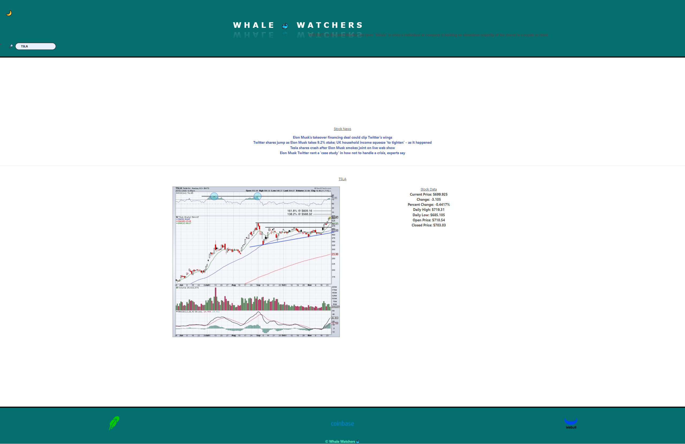

# Project1
This group project is a Stock app that allows users who want to day trade , long term share hold, or even large corperations looking for partnership the ability to use  a stocks ticker (Ex. AAPL for apple or TSLA for tesla ) and recieve relative news information on that search stock . It also displays the stocks data for : Current Price,Change,Percent Change,Daily Low,Daily High,Open Price and Closed Price. Inside of our application we've added a fun easter egg yet we won't ruin the search but Hint Hint:Try clicking around the Icons to see why we call ourselves "Whale Watchers." We also have a dark mode availble via the Moon icon for indivual who may be working late nights or just want that easier on the eyes type of aura.
Hopefully in the near future to come we at Whale Watchers have aspirations on updating the website with more stimulating visuals and further advancing user resources;Such as a reactive stock chart that shows you live data, and a search function that allows you to see the top companies people near you are investing in with hopes it can bring you networking with like minded people. 

Deployed link: https://jgordon59.github.io/Whale-Watchers/
Github Repo Link: https://github.com/JGordon59/Whale-Watchers

